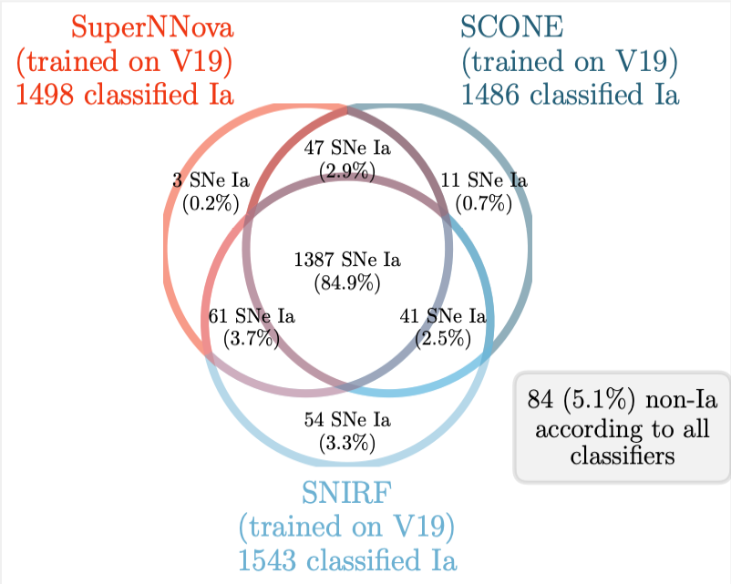
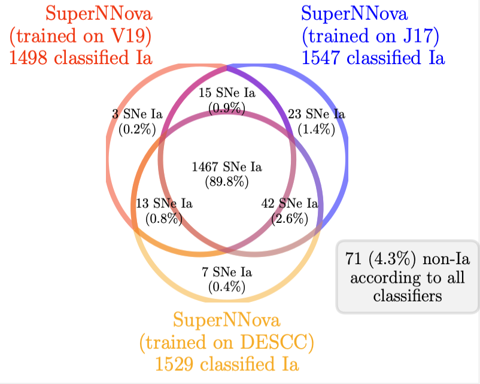

################################################
3 - CLASSIFICATION: Classification probabilities
################################################

Overview
========

DES used 3 classifiers to select Type Ia Supernovae. 
Here are released the probabilities of the 1635 used SNIa for the DES-SN5YR Hubble Diagram.

Classifiers
===========

We made use of the following classifiers:

- **SuperNNova**
  
  - References
  
    - `Moller et al. 2019`_
    - `Moller et al. 2022`_ 
    - `Möller et al. 2024`_
  
  - Documentation: https://supernnova.readthedocs.io/en/latest/index.html

- **SCONE**

  - References

    - `Qu et al. 2021`_

  - Documentation: https://github.com/helenqu/scone

- **SNIRF**

  - Documentation: https://github.com/evevkovacs/ML-SN-Classifier

Classifier agreement
--------------------

.. :width: 200

.. :width: 200

Release Format
==============

A single ``csv`` file is released with the candidate ID (``CID``) as the single event identifier, in combination with the probabilities.

Column definitions
^^^^^^^^^^^^^^^^^^

- ``PROB_SNNV19`` (*) - Probability of being Ia from ``SuperNNova`` trained on sims generated using core-collapse templates from `Vincenzi et al. 2019`_ (*Nominal*)
- ``PROB_SNNDESCC`` - Probability of being Ia from ``SuperNNova`` trained on sims generated using core-collapse templates from `Jones et al. 2017`_
- ``PROB_SNNJ17`` - Probability of being Ia from ``SuperNNova`` trained on sims generated using core-collapse templates from DES data
- ``PROB_SCONE`` - Probability of being Ia from ``SCONE`` trained on sims generated using core-collapse templates `Vincenzi et al. 2019`_
- ``PROB_SNIRFV19`` - Probability of being Ia from ``SNIRF`` trained on sims generated using core-collapse templates from `Vincenzi et al. 2019`_
- ``PROBCC_BEAMS`` - BEAMS Probability of being core-collapse (see eq. 6 in `Vincenzi et al. 2024`_)

(*) ``PROB_SNNV19`` is our Nominal

...........

.. include:: _static/links.rst
